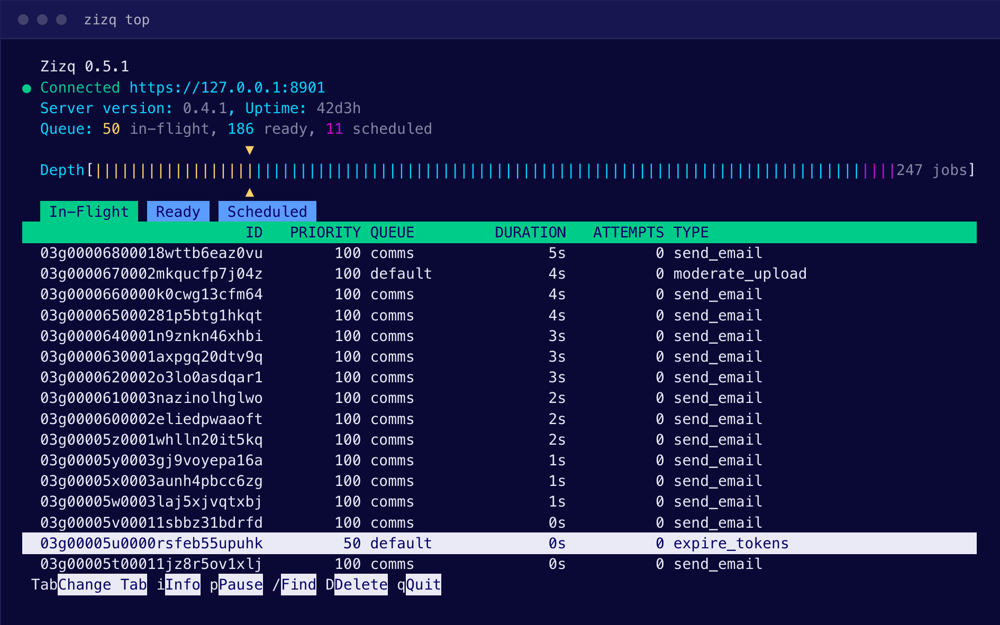

# Zizq Labs

High-performance background job processing and task scheduling powered by a
persistent LSM-tree database. Works in any stack.

[Zizq](https://zizq.io) (**/zɪsk/**) is a fast and durable job queue packed
into a single native binary, built on an embedded LSM database — not on Redis,
and not on your application’s RDBMS.

```shell
$ zizq serve
Zizq 0.6.1
Listening on 127.0.0.1:8901 (admin)
Listening on 127.0.0.1:7890 (primary)
```

[**Get Started →**](https://zizq.io/docs/getting-started/) · [Website](https://zizq.io) · [Docs](https://zizq.io/docs) · [Source](https://github.com/zizq-labs/zizq)

---

## Works across your entire stack

Zizq is a language agnostic job queue, usable from any environment with an
HTTP client. Jobs can be enqueued in one language can be processed by a worker
written in another.

Need to enqueue in Node and process in Rust? Zizq does that.

```ts
// Node.js — the producer
await client.enqueue({
  type: "send_email",
  queue: "emails",
  payload: { userId: 42, template: "welcome" },
});
```

```rust
// Rust — the worker, in a different service entirely
#[derive(Serialize, Deserialize, JobKind)]
#[zizq(name = "send_email", queue = "emails")]
struct SendEmail { user_id: u64, template: String }
```

Official client libraries for **Node.js**, **Ruby**, **Elixir** and **Rust**
handle connection management and concurrent job dispatch, so your application
stays focused on the important stuff. All official clients are
**MIT licensed**.

<table>
    <tr>
        <th>Clients</th>
        <td><a href="https://github.com/zizq-labs/zizq-node">Node.js</a></td>
        <td><a href="https://github.com/zizq-labs/zizq-ruby">Ruby</a></td>
        <td><a href="https://github.com/zizq-labs/zizq-elixir">Elixir</a></td>
        <td><a href="https://github.com/zizq-labs/zizq-rust">Rust</a></td>
    </tr>
    <tr>
        <th>Reference</th>
        <td><a href="https://zizq.io/docs/getting-started/">Getting Started</a></td>
        <td><a href="https://zizq.io/docs/api/">HTTP API</a></td>
        <td><a href="https://zizq.io/docs/cli/">Command Line</a></td>
        <td></td>
    </tr>
</table>

---

## Watch your queues in real time

Stay in control with a built-in terminal UI providing live queue depth and
worker activity at a glance.

```shell
$ zizq top
```

<p align="center">
  
</p>

---

## Find and update jobs using expressive filters

Being enqueued doesn't mean a job should be locked in. Real life happens, and
you need to identify and operate on work already in the queue.

Match on attributes and powerful `jq`-style expressions, then atomically move
matching jobs between queues, re-prioritise, re-schedule or delete them using
those same filters:

```http
PATCH /jobs?type=send_email&filter=.to|endswith(".au")

{ "priority": 100 }
```

---

## Features

* **Persistent by default** — jobs survive crashes, disconnects and restarts,
  on a transactional LSM-tree database
* **Prioritised queues** — granular priorities blended with simple FIFO, mixed
  across unlimited named queues
* **Backoff and retry** — configurable exponential backoff, global or per-job
  retry limits, and a dead-letter queue
* **Recurring schedules** — time zone aware cron-style schedules with
  second-level granularity
* **Unique jobs** — duplicates prevented at enqueue time, scoped by lifecycle
  rather than arbitrary TTLs
* **Batched jobs** — many small units folded together into one at enqueue time
* **HTTP/2 and HTTP/1.1** — with JSON or MessagePack
* **Job management APIs** — introspect and operate on the queue, including
  `jq` expression filters

---

## Licensing

The Zizq server is **source-available** under BUSL-1.1. Most features are
freely available. Some advanced features require a
[Pro license](https://zizq.io/pricing). Every official client library is
open source and **MIT licensed**.

## Support & Feedback

If you need help using Zizq,
[create an issue](https://github.com/zizq-labs/zizq/issues) on the
[Zizq](https://github.com/zizq-labs/zizq) repo. Feedback is very welcome.
